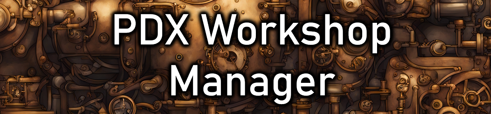
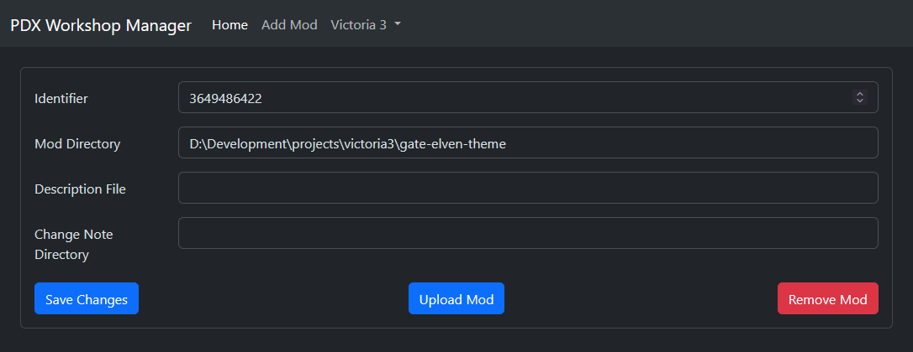

# Overview

**pdx-workshop-manager** is a tool to publish paradox mods (only Victoria 3 for now),
to the steam workshop in repeatable and configurable way.

There are both **Windows** and **Linux** builds. If requested a **MacOSX** build can be added.

**Thanks to [nnnn20430](https://github.com/nnnn20430) for creating a go based wrapper of the original steamworks API.**



## Contents

* [How does it work?](#how-does-it-work)
* [Configuration](#configuration)
    * [Attributes](#attributes)
    * [Example](#example-json-config)
* [Change Notes](#adding-workshop-change-notes)
* [Usage](#usage)

## Status

[](https://github.com/kaiser-chris/pdx-workshop-manager/releases)

## How does it work?

The tool will parse the `metadata.json` of either a provided configured mod
or each configured mod and then publish the mod to the steam workshop.

It supports the following features:
- Updating the workshop **name** based on the name in the `metadata.json` 
- Updating the workshop **tags** based on the tags in the `metadata.json`
- Updating the workshop **description** based on a configured file
- Updating the workshop **thumbnail** based on the `thumbnail.png` in the root of the mod folder
- Adding a **change note** to workshop update based on a configured directory

## Configuration

The tool is configured using a json file.

### Attributes

- **REQUIRED** `game` steam app id of the game to upload for
- **REQUIRED** `mods`a list of mods that can be uploaded
- **REQUIRED** `id` id of the mod to upload, if kept `0` it will create the mod on the first upload and replace the id with the newly created one
- **REQUIRED** `directory` location of the mod, either a relative path from the executable or an absolute path
- **OPTIONAL** `description` file containing the steam description bbcode
- **OPTIONAL** `change-note-directory` directory containing files with version based change notes (see [change notes](#adding-workshop-change-notes))

### Example JSON config

```json
{
  "game": 529340,
  "mods": [
    {
      "id": 0,
      "directory": "/Path/To/Mod",
      "description": "/Path/To/Bbcode/File/STEAM_PAGE.bbcode",
      "change-note-directory": "/Path/To/Change/Note/Directory"
    }
  ]
}
```

## Adding Workshop Change Notes

The application will try to add change notes if a `change-note-directory` is defined.

It does this by reading the `version` attribute from the `metadata.json` and adding a `.bbcode` at the end.

So if a mod has the version `1.0.1` it will try to find a file called `1.0.1.bbcode` in the change note directory.

> **NOTE** The upload will **not** fail if there is no corresponding change note,
> but just warn about it in the console output.

## Usage

First download the latest release from the Releases page of the repository:

- https://github.com/kaiser-chris/pdx-workshop-manager/releases

> The ZIP may be marked as a *Virus*.
> This is a **false positive**!
>
> If you do not trust this, then you can [build](#how-to-build) it yourself.

### Graphical UI

Download the GUI version and after unzipping it simply run the provided executable.
It will allow you to set up mods to be uploaded and do the upload.



### Command Line

Then, after configuration it, you can run the application by double-clicking,
or running it in the terminal like this:

```
.\pdx-workshop-manager.exe
```

By default, the application expects the config file to be in the same folder as the executable
and will upload **all** mods configured in it. 

> **NOTE** You need to have steam running and be logged in for the tool to work!

All optional commands can be found in the help dialog. Help dialog (`.\pdx-workshop-manager.exe -h`):

```
Usage of pdx-workshop-manager:
  -config string
    	Path to the config file (default "manager-config.json")
  -mod uint
    	Configured workshop mod id or 0 for all mods (default 0)
```

## How To Build

First download and install the Go SDK:

- https://go.dev/doc/install

Next, download the steamworks SDK:

- https://partner.steamgames.com/doc/sdk

Unzip and place the steamworks SDK into the project folder (the `sdk` folder should be in the project root).

Finally, you can run `go build` to create the command line tool version.
Or, you can run `go build -tags gui` to create the gui version.

### Makefile
Alternatively, there is a Makefile in the project to build both command line and GUI versions. For both Windows and Linux.

The resulting release versions can be found in the `dist` folder.